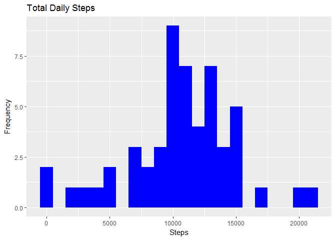
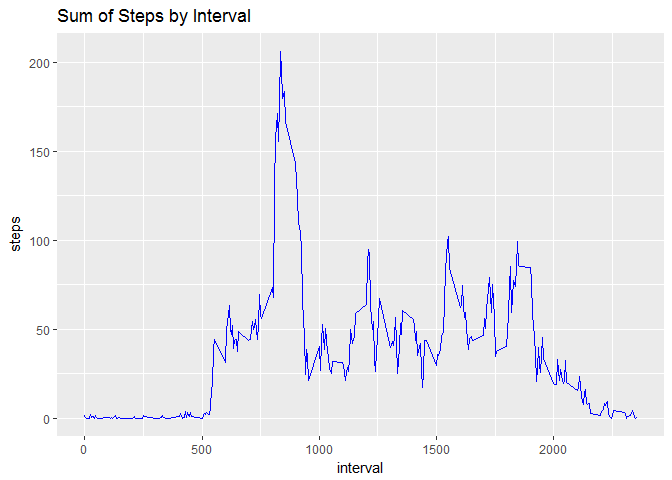
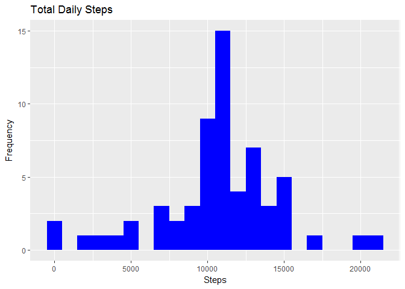
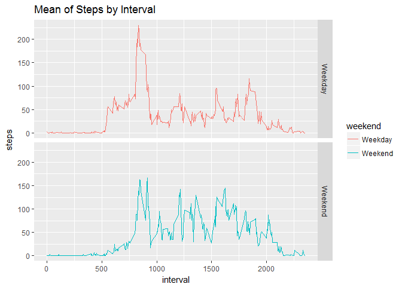

Week 2: Peer-graded Assignment: Course Project 1
================
Isaiah McCommons
June 29, 2018

==========================

### 1. EXPLORATORY ANALYSIS

1-1. Load and preprocess the data.

``` r
# graphics library load
        library(ggplot2)
```

1-2. Unzip file and read data into data frame.

``` r
# Unzip archive
        unzip("activity.zip")

# Read base data into a data frame.
        activity <- read.csv("activity.csv")
```

1-3. Summerize activity data using Dim, Head, String and Summary.

``` r
# Activity data Dim
        dim(activity)
```

    ## [1] 17568     3

``` r
# Activity data Head
        head(activity)
```

    ##   steps       date interval
    ## 1    NA 2012-10-01        0
    ## 2    NA 2012-10-01        5
    ## 3    NA 2012-10-01       10
    ## 4    NA 2012-10-01       15
    ## 5    NA 2012-10-01       20
    ## 6    NA 2012-10-01       25

``` r
# Activity data String
        str(activity)
```

    ## 'data.frame':    17568 obs. of  3 variables:
    ##  $ steps   : int  NA NA NA NA NA NA NA NA NA NA ...
    ##  $ date    : Factor w/ 61 levels "2012-10-01","2012-10-02",..: 1 1 1 1 1 1 1 1 1 1 ...
    ##  $ interval: int  0 5 10 15 20 25 30 35 40 45 ...

``` r
# Activity data Summary
        summary(activity)
```

    ##      steps                date          interval     
    ##  Min.   :  0.00   2012-10-01:  288   Min.   :   0.0  
    ##  1st Qu.:  0.00   2012-10-02:  288   1st Qu.: 588.8  
    ##  Median :  0.00   2012-10-03:  288   Median :1177.5  
    ##  Mean   : 37.38   2012-10-04:  288   Mean   :1177.5  
    ##  3rd Qu.: 12.00   2012-10-05:  288   3rd Qu.:1766.2  
    ##  Max.   :806.00   2012-10-06:  288   Max.   :2355.0  
    ##  NA's   :2304     (Other)   :15840

1-4. Change data type of date, create logical vector for NA and clean activity for mean calculations.

``` r
# change date type to date class 
        activity$date <- as.Date(as.character(activity$date))

# create NA logical vector
        activityNA <- is.na(activity$steps)

# create clean activity for later mean calculations
        cleanActivity <- activity[!activityNA,]
```

### 2. ACTIVITY MONITORING RESULTS

2-1. Code for reading in the dataset and/or processing the data.

``` r
SummedActivityByDay <- aggregate(activity$steps, by=list(activity$date), sum)

# adjust column names
        names(SummedActivityByDay)[1] ="date"
        names(SummedActivityByDay)[2] ="totalsteps"

# top 15 of Summed Steps by day
        head(SummedActivityByDay,15)
```

    ##          date totalsteps
    ## 1  2012-10-01         NA
    ## 2  2012-10-02        126
    ## 3  2012-10-03      11352
    ## 4  2012-10-04      12116
    ## 5  2012-10-05      13294
    ## 6  2012-10-06      15420
    ## 7  2012-10-07      11015
    ## 8  2012-10-08         NA
    ## 9  2012-10-09      12811
    ## 10 2012-10-10       9900
    ## 11 2012-10-11      10304
    ## 12 2012-10-12      17382
    ## 13 2012-10-13      12426
    ## 14 2012-10-14      15098
    ## 15 2012-10-15      10139

2-2. Histogram of the total number of steps taken each day.

``` r
# Plot using ggplot
        ggplot(SummedActivityByDay, aes(x = totalsteps)) +
                geom_histogram(fill = "blue", binwidth=1000) +
                labs(title = "Total Daily Steps", x = "Steps", y = "Frequency")
```

    ## Warning: Removed 8 rows containing non-finite values (stat_bin).



2-3. Mean and median number of steps taken each day.

``` r
# Mean of steps taken per day
        mean(SummedActivityByDay$totalsteps,na.rm=TRUE)
```

    ## [1] 10766.19

``` r
# Median of steps taken per day
        median(SummedActivityByDay$totalsteps,na.rm=TRUE)
```

    ## [1] 10765

2-4. Time series plot of the average number of steps taken.

``` r
# aggregate NA subset
        nonNASubset <- activity[!activityNA,]
                MeanActivityByInterval <- aggregate(nonNASubset$steps, by=list(nonNASubset$interval), mean)
        
# set the column names
        names(MeanActivityByInterval)[1] ="interval"
        names(MeanActivityByInterval)[2] ="steps"
        
        ggplot(MeanActivityByInterval, aes(x = interval, y=steps)) +
                labs(title = "Sum of Steps by Interval", x = "interval", y = "steps")+
                geom_line(color="blue")
```



2-5. The 5-minute interval that, on average, contains the maximum number of steps.

``` r
maxInterval <- MeanActivityByInterval[which.max(MeanActivityByInterval$steps),]
maxInterval
```

    ##     interval    steps
    ## 104      835 206.1698

2-6. Code to describe and show a strategy for imputing missing data.

``` r
# generate listing of NA's
        missingVals <- sum(activityNA)
        missingVals
```

    ## [1] 2304

``` r
# new dataset
        activity2 <- activity
        
# NA's in dataset
# dataset minus NA's for Mean calculation
        NAActivity2 <- activity2[is.na(activity2$steps),]
        cleanActivity2 <- activity2[!is.na(activity2$steps),]
        
# generate mean Activity2 by interval
        MeanActivity2ByInterval <- aggregate(cleanActivity2$steps, by=list(cleanActivity2$interval), sum)
        names(MeanActivity2ByInterval)[1] ="interval"
        names(MeanActivity2ByInterval)[2] ="steps"
        
# imputing
        activity2 <- activity
        missingActivity <- is.na(activity2$steps)
        meanVals <- tapply(cleanActivity$steps, cleanActivity$interval, mean, na.rm=TRUE, simplify=TRUE)
        activity2$steps[missingActivity] <- meanVals[as.character(activity2$interval[missingActivity])]
        
# original missing data count
        sum(missingActivity)
```

    ## [1] 2304

``` r
# count of NA values
        sum(is.na(activity2$steps))
```

    ## [1] 0

2-7. Histogram of the total number of steps taken each day after missing values are imputed.

``` r
        FullSummedActivityByDay <- aggregate(activity2$steps, by=list(activity2$date), sum)
        
        names(FullSummedActivityByDay)[1] ="date"
        names(FullSummedActivityByDay)[2] ="totalsteps"
        head(FullSummedActivityByDay,15)
```

    ##          date totalsteps
    ## 1  2012-10-01   10766.19
    ## 2  2012-10-02     126.00
    ## 3  2012-10-03   11352.00
    ## 4  2012-10-04   12116.00
    ## 5  2012-10-05   13294.00
    ## 6  2012-10-06   15420.00
    ## 7  2012-10-07   11015.00
    ## 8  2012-10-08   10766.19
    ## 9  2012-10-09   12811.00
    ## 10 2012-10-10    9900.00
    ## 11 2012-10-11   10304.00
    ## 12 2012-10-12   17382.00
    ## 13 2012-10-13   12426.00
    ## 14 2012-10-14   15098.00
    ## 15 2012-10-15   10139.00

``` r
# Plot using ggplot
        ggplot(FullSummedActivityByDay, aes(x = totalsteps)) +
                geom_histogram(fill = "blue", binwidth=1000) +
                labs(title = "Total Daily Steps", x = "Steps", y = "Frequency")
```



``` r
# Mean on New Data
        mean(FullSummedActivityByDay$totalsteps)
```

    ## [1] 10766.19

``` r
# Median on New Data
        median(FullSummedActivityByDay$totalsteps)
```

    ## [1] 10766.19

2-8. Panel plot comparing the average number of steps taken per 5-minute interval across weekdays and weekends.

``` r
#differences in 5-minute intervals
        activity2$weekday <- weekdays(activity2$date)
        activity2$weekend <- ifelse (activity2$weekday == "Saturday" | activity2$weekday == "Sunday", "Weekend", "Weekday")
        
        head(activity2,5)
```

    ##       steps       date interval weekday weekend
    ## 1 1.7169811 2012-10-01        0  Monday Weekday
    ## 2 0.3396226 2012-10-01        5  Monday Weekday
    ## 3 0.1320755 2012-10-01       10  Monday Weekday
    ## 4 0.1509434 2012-10-01       15  Monday Weekday
    ## 5 0.0754717 2012-10-01       20  Monday Weekday

``` r
#plot
        MeanActivityWeekendWeekday <- aggregate(activity2$steps, by=list(activity2$weekend, activity2$interval), mean)
        names(MeanActivityWeekendWeekday)[1] ="weekend"
        names(MeanActivityWeekendWeekday)[2] ="interval"
        names(MeanActivityWeekendWeekday)[3] ="steps"
        
        ggplot(MeanActivityWeekendWeekday, aes(x = interval, y=steps, color=weekend)) +
                geom_line() +
                facet_grid(weekend ~ .) +
                labs(title = "Mean of Steps by Interval", x = "interval", y = "steps")
```


